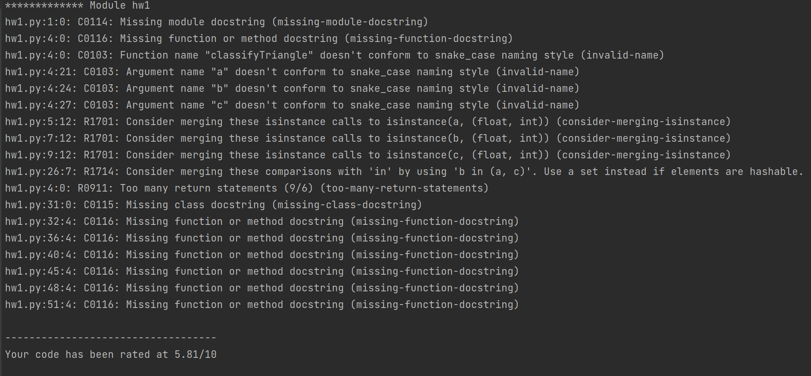
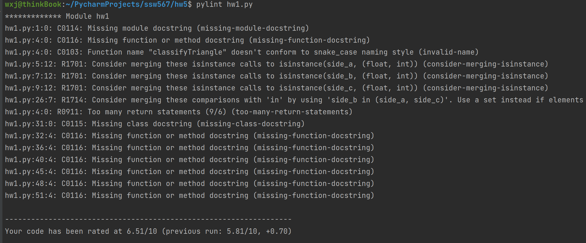
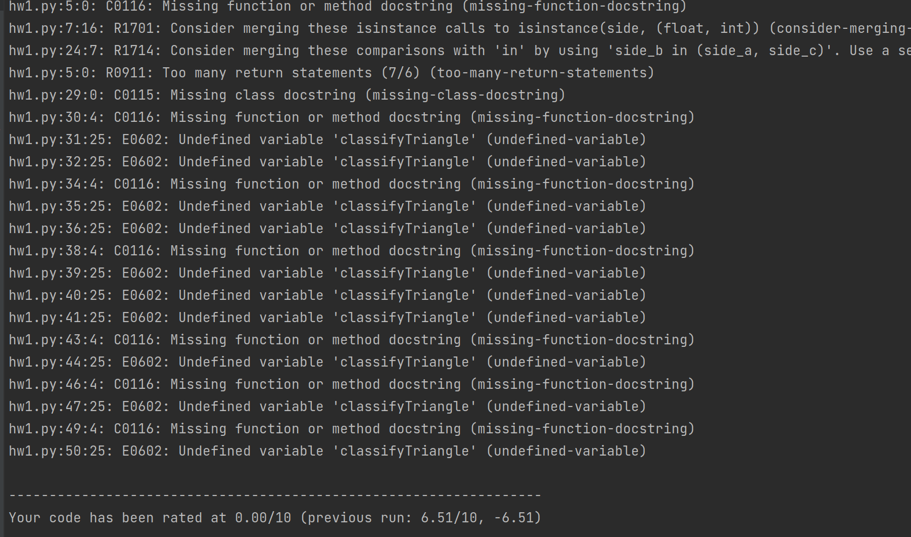
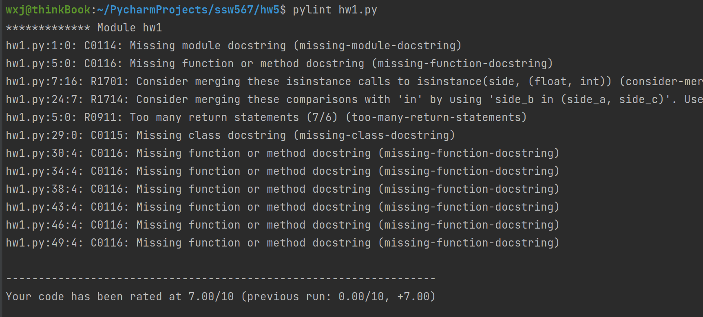
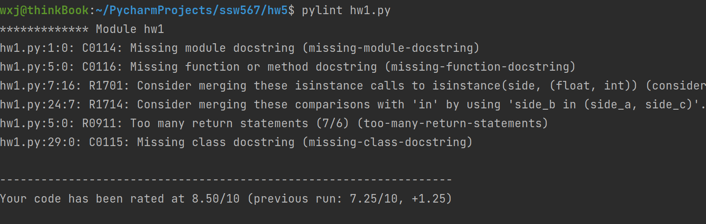
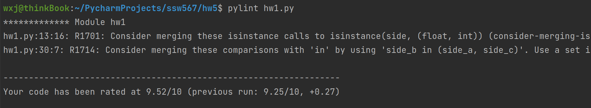
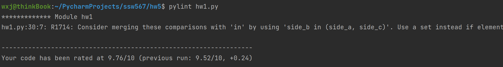
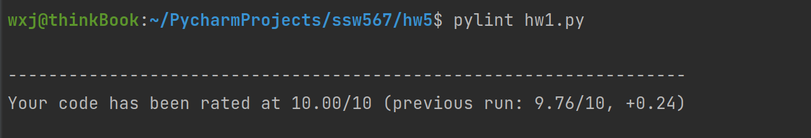
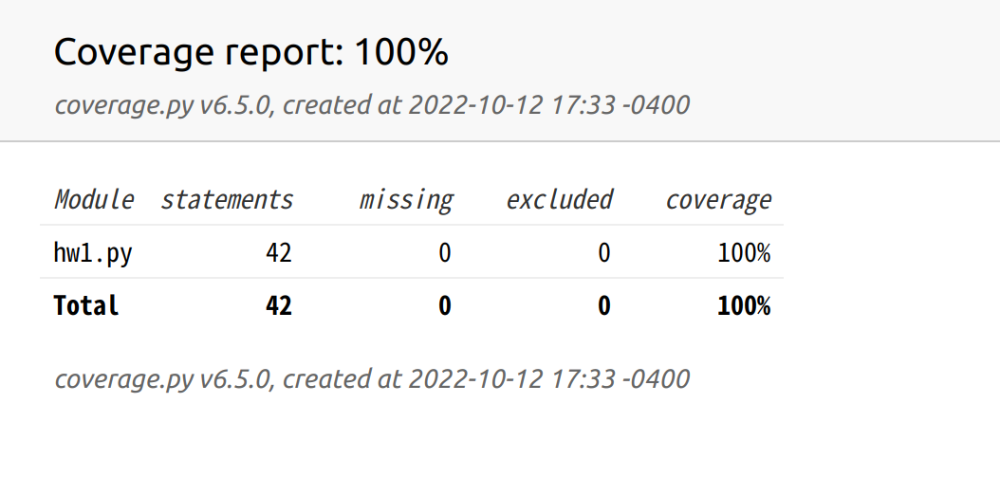

- The GitHub URL containing the code that was analyzed  
https://github.com/yiyayamaya/ssw567/tree/main/hw5  

- The name and output of the static code analyzer tool you used;   
pylint   

- The name and output of the code coverage tool you used;  
coverage

- Identify both your original test cases and new test cases that you created to achieve at least 80% code coverage.  
my original test cases arrive at 100% percent code coverage. So I did not create new test cases.

- Attach screen shots of the output of the static code analyzer as well as code coverage.  You should show a screen shot of the analysis results both before and after any changes that you make to your programs:

- Static code analysis report on original program

- Code coverage report before any changes to the program

- Static code analysis report after you have made changes to eliminate issues

- Code coverage after any changes to the programs (coverage should be > 80%)
