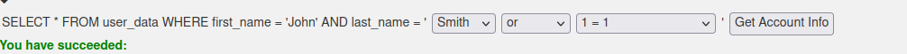
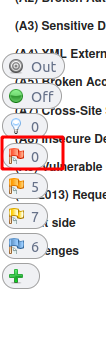
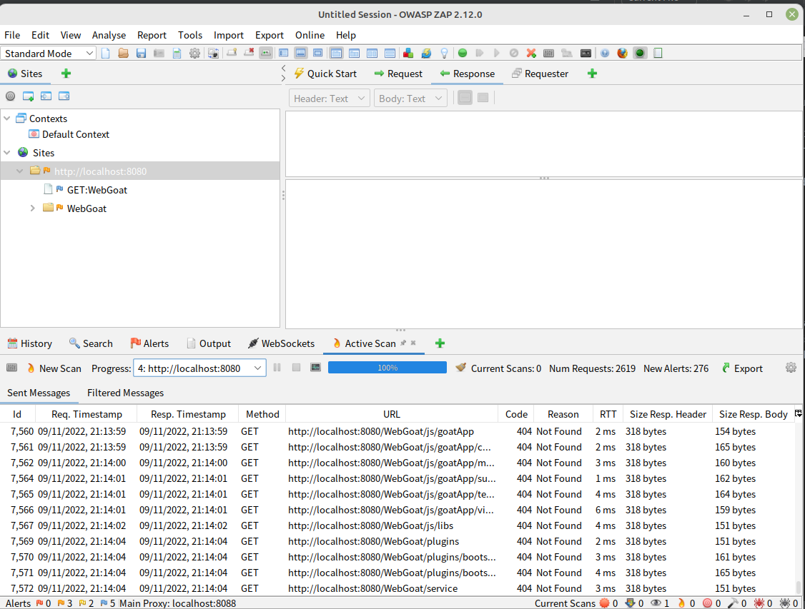

# ssw567

### part 1
- What is the string that you entered into the name field to solve this challenge?
 

- What is the Hershey Jolly's  AMEX credit card number?  
 333300003333

- What is the string that you entered into the name field to solve this challenge?  
';SELECT * FROM user_system_data where '1'='1

- What is password of the user whose user_name is 'dave' ?  
passW0rD

- Describe in your own words how you attacked this "site" to reveal the internal information  
  SQL injection
  - What would you do to prevent this attack in your websites?  
  use Queries with parameter. in JDBC we use PreparedStatement "select * from stu where name=?"
 

### part 2:

- List and describe all of the "high risk" alerts that ZAP identifies with your local instance of WebGoat. 
  I did not find any high risk. I don't know why. I follow the guide step by step. Every thing looks fine but no high risk.

- Include a screen dump of the ZAP window after you have completed the scan in your report.